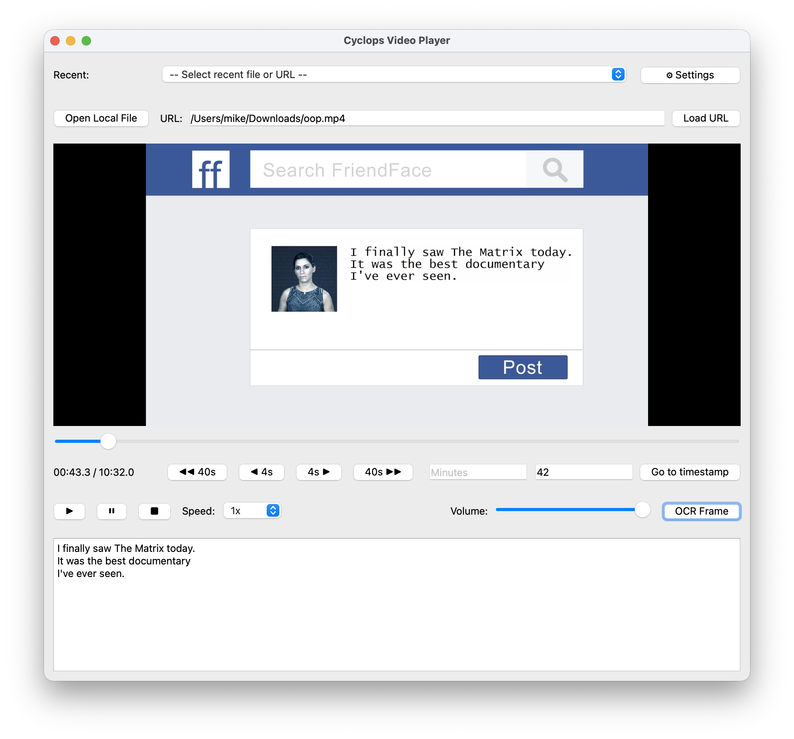

## User Stories for OCR video player
# myk, 11/2025, J336025

As a blind computer science student,
I want to  know when new text appears on the screen, 
so I may pause have it read out.

As a blind computer science student,
I want to  have the reader read out highlighted text
so that I know what is being referred to by the voice.

As a blind user of NVDA with Chrome,
I want to play a video within the browser, linked from a web page, and pause it to an audio description from a frame.

As a blind computer science student, 
I want to able to understand an instructional video, including the text examples,
so that I can gain the skills being taught.

As a blind user,
I want to use the app with keyboard only,
so that i can easily find UI elements for both input, and screen-reader output.

As a blind user,
I need to be easily able to control the playback speed
so I can efficiently manage time. 

# Wireframes / UI Interaction Patterns

As this is a single-page app, the user interaction is very straightforward.
See the fields in the screenshot below. A user will:
- select a video, using the OS native file selector, or by entering a URL.
- play/pause/skip the video using buttons or keyboard shorcuts
- use key or button to capture text from a frame.
- use their choice of screenreader to read out the text.

